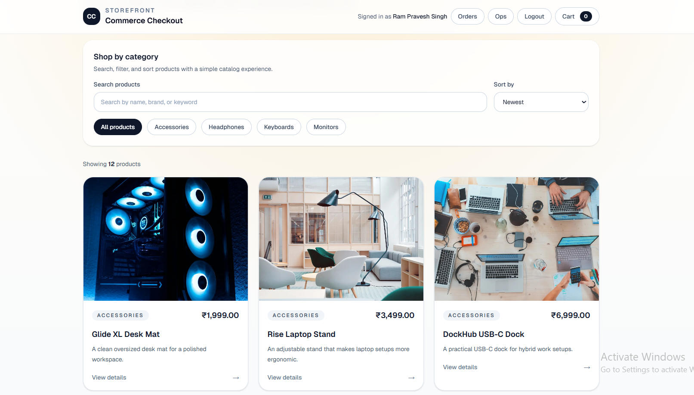
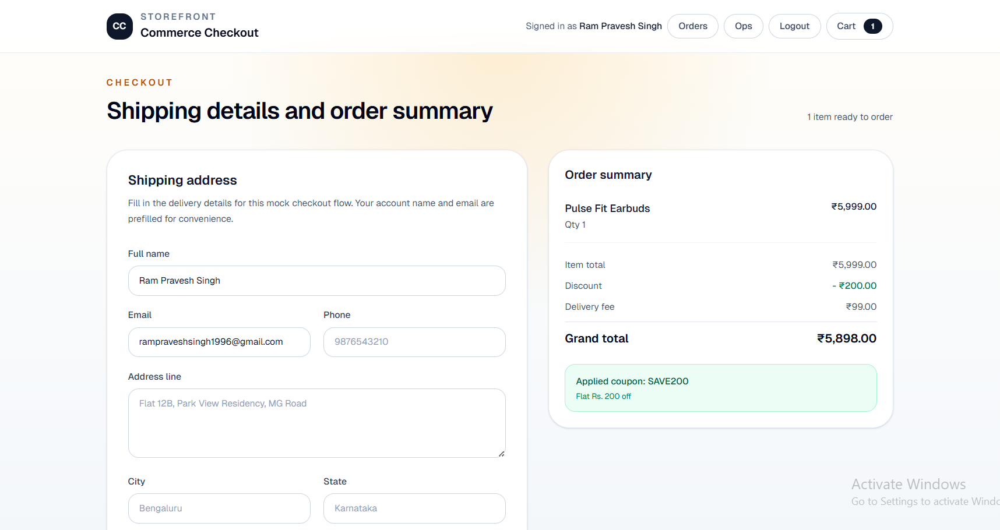
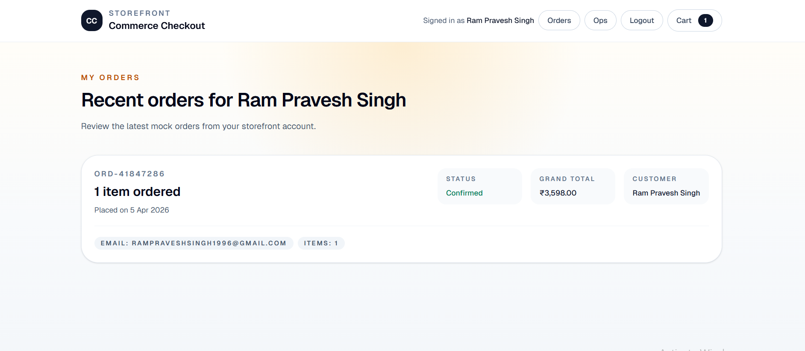

# Commerce Checkout and Order Lifecycle System

A production-style full stack ecommerce project built to showcase product engineering skills across **catalog discovery, cart, coupons, checkout, authentication, mock order lifecycle, and admin-lite operations**.

This project is designed as a strong portfolio piece for **frontend-focused full stack**, **full stack**, and **product engineering** roles.

## Tech Stack

### Frontend
- Next.js
- TypeScript
- Tailwind CSS
- React Context + localStorage/sessionStorage for browser-side state

### Backend
- Node.js
- Express.js
- TypeScript
- Prisma
- MySQL
- JWT authentication
- Zod validation
- bcryptjs password hashing

## Core Features

### Storefront
- Product listing page
- Category filter
- Search input
- Sorting dropdown
- Product details page
- Responsive product cards
- Shared sticky storefront header

### Cart and Pricing
- Add to cart
- Cart page with quantity controls
- Remove item
- Browser-persisted cart state
- Coupon input with mock coupon rules
- Pricing summary with item total, discount, delivery fee, and grand total

### Authentication
- Signup
- Login
- Logout
- JWT-based backend auth APIs
- Browser-persisted auth state
- Logged-in header state

### Checkout and Orders
- Protected checkout flow
- Redirect to login if unauthenticated
- Return to checkout after login
- Prefilled logged-in user name and email
- Shipping form validation
- Mock order placement
- Dedicated order confirmation page
- Protected My Orders page with browser-stored mock order history

### Ops / Admin-lite
- Protected `/ops/orders` page
- View all mock orders from browser storage
- Filter orders by status
- Update order status:
  - Confirmed
  - Packed
  - Shipped
  - Delivered

## Mock Coupon Codes

- `SAVE200` → flat ₹200 off
- `WELCOME10` → 10% off
- `DESK15` → 15% off

## Routes

### Frontend
- `/` → Catalog page
- `/products/[id]` → Product details
- `/cart` → Cart
- `/checkout` → Protected checkout
- `/order-confirmation` → Mock order confirmation
- `/orders` → Protected My Orders page
- `/ops/orders` → Protected admin-lite order operations page
- `/login` → Login
- `/signup` → Signup

### Backend
- `GET /health`
- `GET /categories`
- `GET /products`
- `GET /products/:id`
- `POST /auth/signup`
- `POST /auth/login`

## Screenshots

### Home / Catalog


### Checkout


### My Orders


## Local Setup

### 1. Clone the repository
```bash
git clone https://github.com/rampravesh19-96/commerce-checkout-system.git
cd commerce-checkout-system